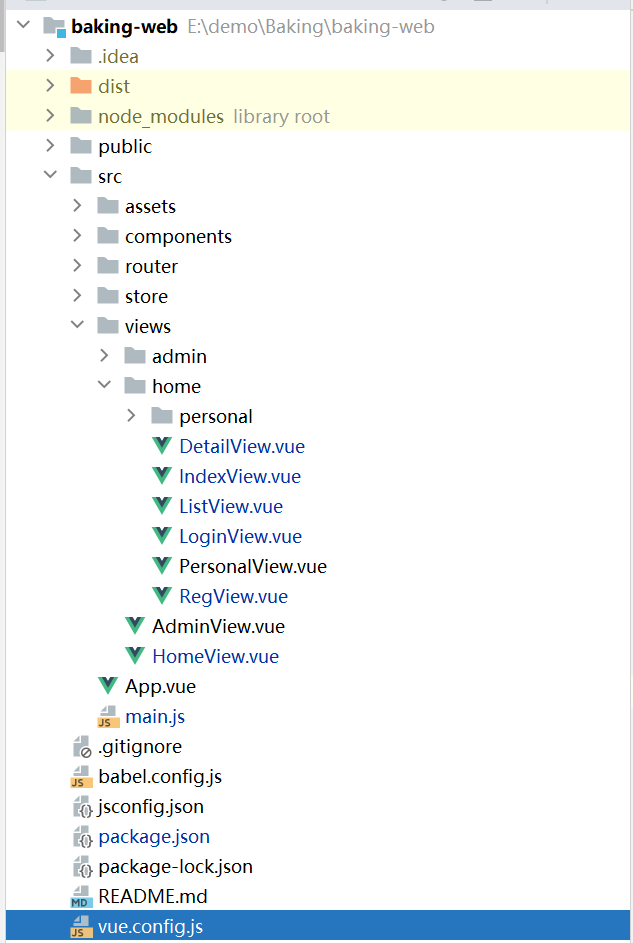
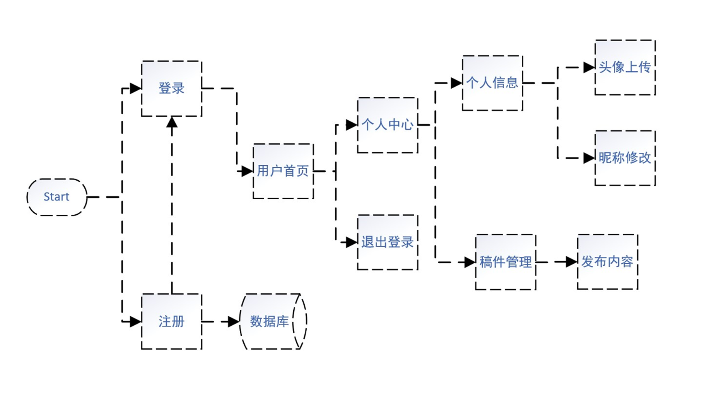
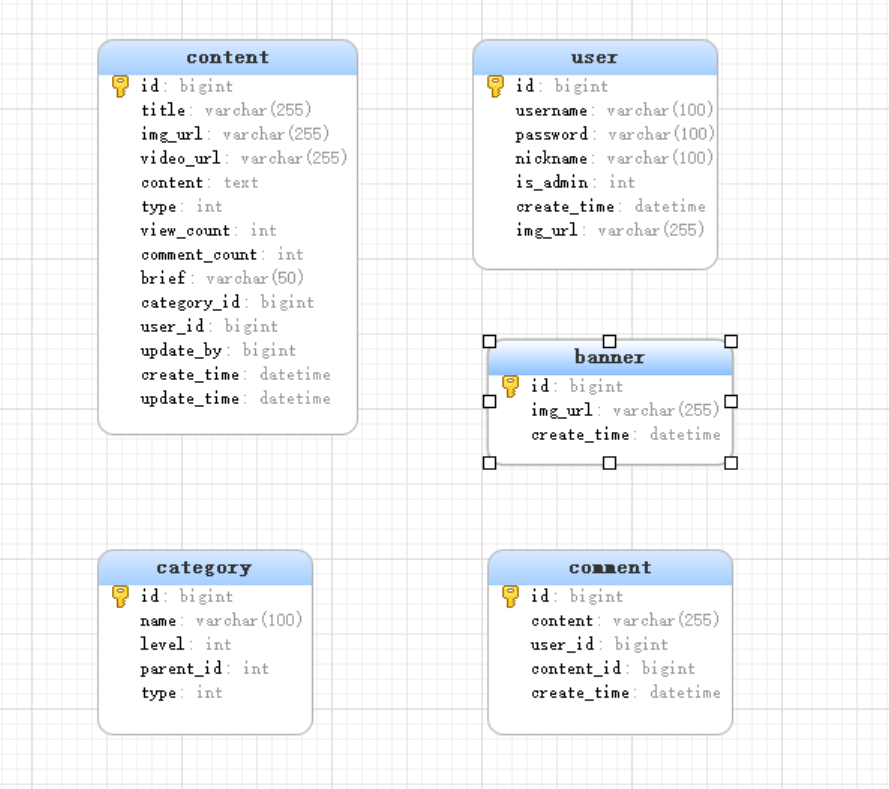
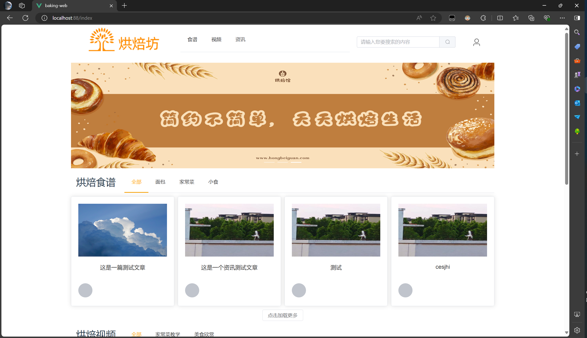
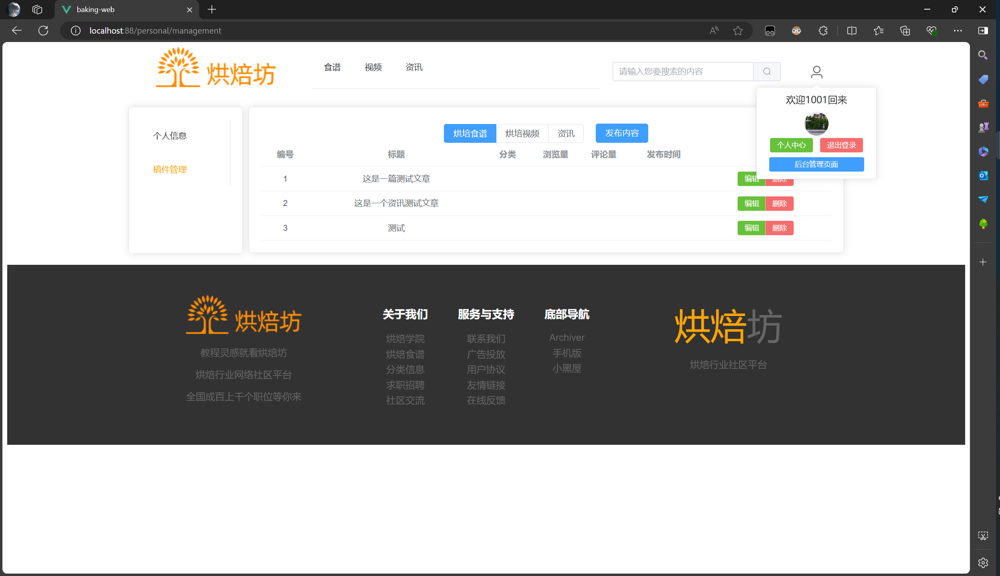
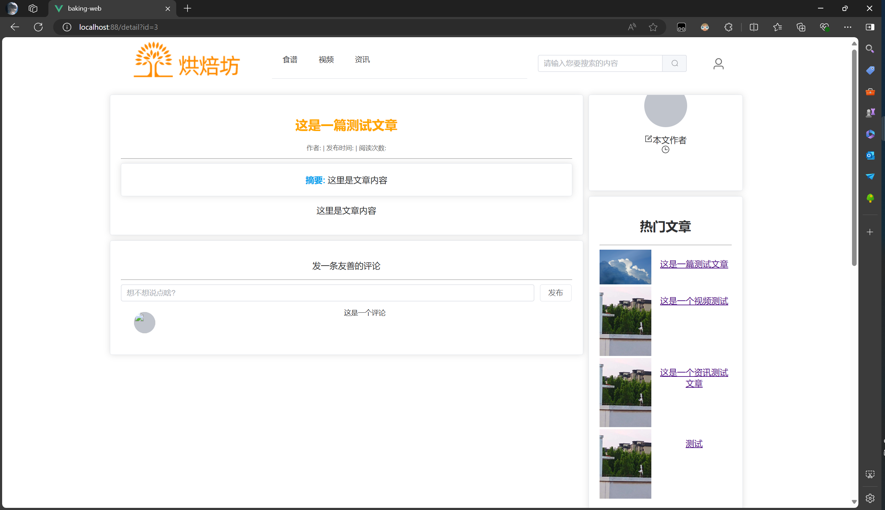
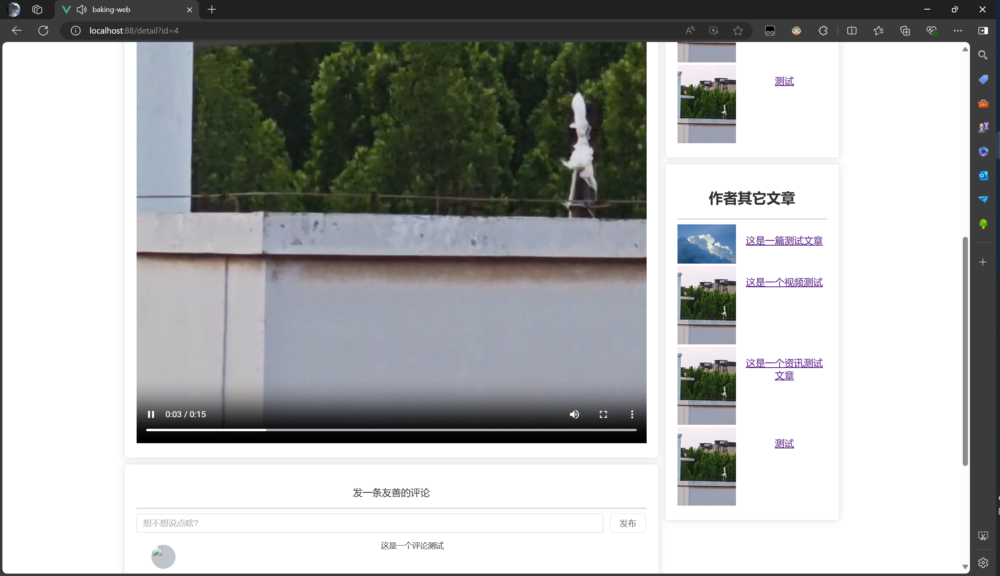
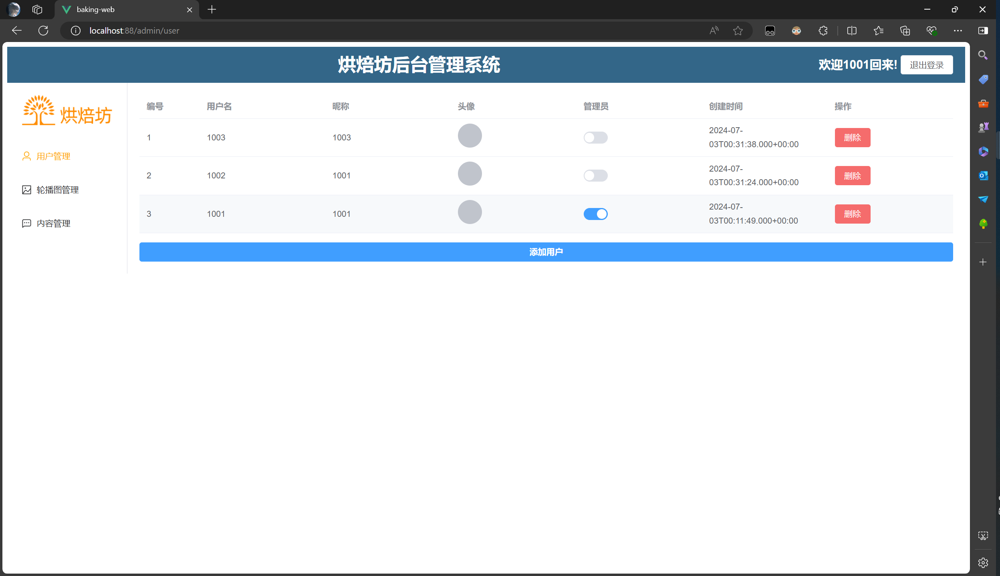
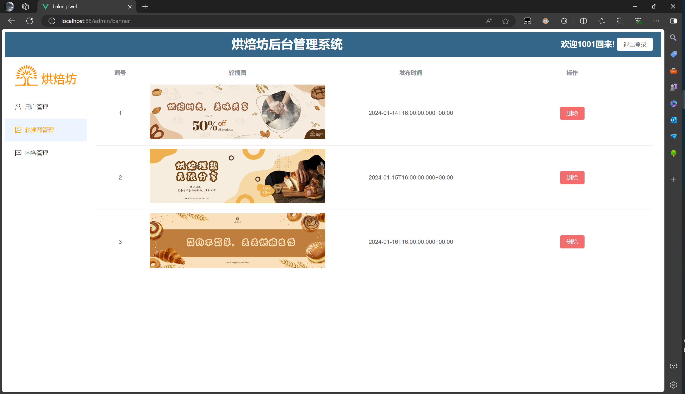
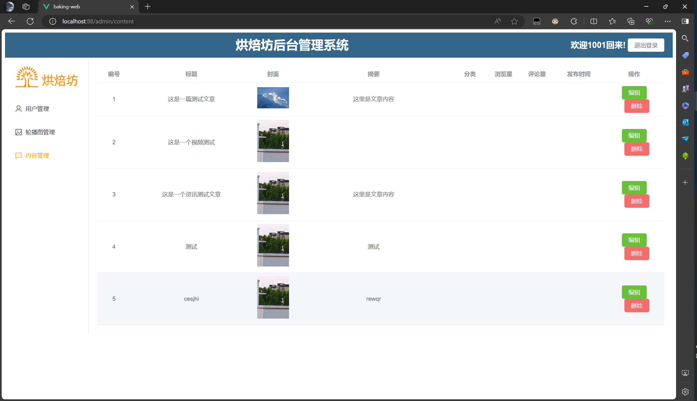

# Baking——springboot+vue项目

## 项目特点

### 采用MD5+salt的方式进行密码加密

1. 增强密码安全性

2. 防止暴力破解

3. 适应性和灵活性

4. 易于实现和验证

5. 兼容性和性能

   

### 使用mybatis-plus-generator

1. #### **提高开发效率**

- 自动化生成代码：MyBatis-Plus-Generator能够自动生成与数据库表对应的Java实体类、Mapper接口、XML配置文件等，极大地减少了开发者手动编写重复代码的时间。
- 一键式生成：通过简单的配置和命令，即可完成整个项目的代码生成，使得开发者能够将更多精力集中在业务逻辑的开发上。

2. #### **增强代码一致性**

- 统一代码风格：通过模板和配置，MyBatis-Plus-Generator可以根据团队规范自由定制生成的代码风格，确保每个新建的模型都有统一的格式和规范。
- 减少人为错误：自动化生成的代码减少了因手动编写代码而产生的人为错误，提高了代码的质量和稳定性。

3. #### **高度可定制性**

- 模板引擎支持：MyBatis-Plus-Generator支持多种模板引擎（如Velocity、FreeMarker等），允许用户自定义模板以满足特定的需求。
- 灵活的配置选项：提供了丰富的配置选项，包括全局配置、包配置、模板配置和策略配置等，使得开发者可以根据项目需求进行灵活配置。

4. #### **易于集成**

- 无缝融入现有流程：MyBatis-Plus-Generator可以轻松集成到Maven、Gradle等构建工具中，无缝融入现有的开发流程。
- 可视化操作界面（如mybatis-plus-generator-ui）：对于一些工具版本，还提供了基于Web的可视化操作界面，通过简单的拖拽和配置即可生成代码，进一步降低了使用门槛。

5. #### **注解驱动**

- 减少XML配置：除了传统的XML文件配置方式，还支持使用注解进行Mapper定义，使得代码更加简洁、易读。

### 使用阿里云服务器进行部署发布

## 运行环境

| 环境                   | 版本     |
| ---------------------- | -------- |
| node.js                | 20.15.0  |
| vue                    | 3.2.13   |
| mysql                  | 5.6      |
| maven                  | 3.6.0    |
| jdk                    | 1.8.0_45 |
| mybatis-plus           | 3.5.1    |
| mybatis-plus-generator | 3.5.1    |
| axios                  | 1.7.2    |
| Element-plus           | 2.7.4    |
| vue-route              | 4.0.3    |
| vuex                   | 4.0.0    |

## 项目结构

### springboot结构

### vue结构

## 项目流程图

## 数据库结构图

## 运行截图

### 首页效果

### 个人信息页效果

### 文章信息页效果

### 视频信息页效果

### 后端用户管理页效果

### 轮播图管理页效果

### 内容管理页效果

