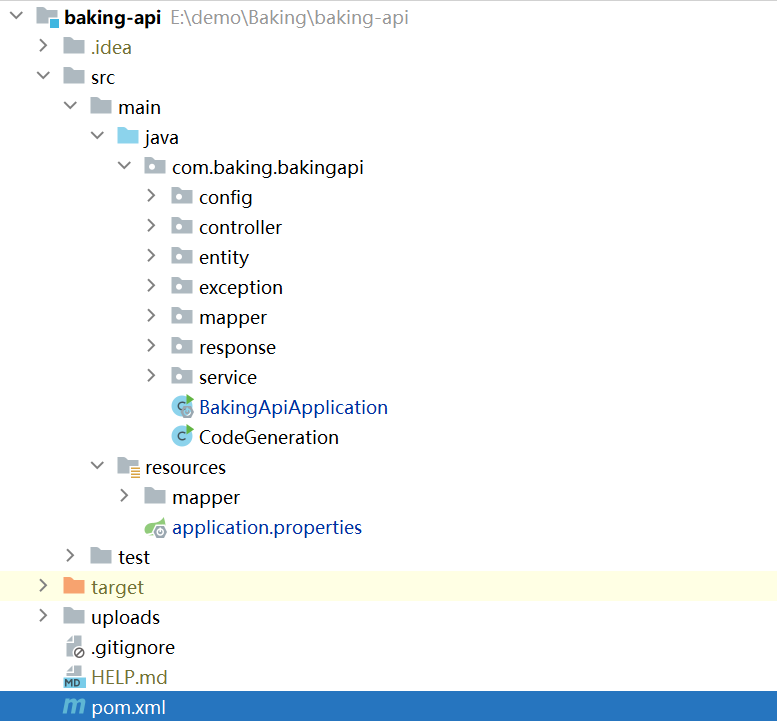

# Baking——springboot+vue项目

## 项目预览

**在线访问地址**（图片无法加载） 	http://8.130.106.195:88

访问过程中如果跳转失败，请重新访问http://8.130.106.195:88

## 项目特点

### 采用MD5+salt的方式进行密码加密

1. 增强密码安全性

2. 防止暴力破解

3. 适应性和灵活性

4. 易于实现和验证

5. 兼容性和性能

   


### 使用mybatis-plus-generator

1. #### **提高开发效率**

- 自动化生成代码：MyBatis-Plus-Generator能够自动生成与数据库表对应的Java实体类、Mapper接口、XML配置文件等，极大地减少了开发者手动编写重复代码的时间。
- 一键式生成：通过简单的配置和命令，即可完成整个项目的代码生成，使得开发者能够将更多精力集中在业务逻辑的开发上。

2. #### **增强代码一致性**

- 统一代码风格：通过模板和配置，MyBatis-Plus-Generator可以根据团队规范自由定制生成的代码风格，确保每个新建的模型都有统一的格式和规范。
- 减少人为错误：自动化生成的代码减少了因手动编写代码而产生的人为错误，提高了代码的质量和稳定性。

3. #### **高度可定制性**

- 模板引擎支持：MyBatis-Plus-Generator支持多种模板引擎（如Velocity、FreeMarker等），允许用户自定义模板以满足特定的需求。
- 灵活的配置选项：提供了丰富的配置选项，包括全局配置、包配置、模板配置和策略配置等，使得开发者可以根据项目需求进行灵活配置。

4. #### **易于集成**

- 无缝融入现有流程：MyBatis-Plus-Generator可以轻松集成到Maven、Gradle等构建工具中，无缝融入现有的开发流程。
- 可视化操作界面（如mybatis-plus-generator-ui）：对于一些工具版本，还提供了基于Web的可视化操作界面，通过简单的拖拽和配置即可生成代码，进一步降低了使用门槛。

5. #### **注解驱动**

- 减少XML配置：除了传统的XML文件配置方式，还支持使用注解进行Mapper定义，使得代码更加简洁、易读。

  

### 使用阿里云服务器进行部署发布

​	1. **技术栈优势**

- Spring Boot
  - **简化配置**：Spring Boot通过自动配置和起步依赖（Starters）极大地简化了Spring应用的初始搭建以及开发过程。
  - **内嵌服务器**：支持内嵌Tomcat、Jetty等服务器，无需单独部署WAR文件，简化了部署流程。
  - **纯Java配置**：无需XML配置，所有配置都可以通过Java代码或YAML/Properties文件完成。
  - **监控与健康检查**：提供生产级的服务监控方案，如健康检测、应用监控等。
  - **热部署与热更新**：通过spring-boot-devtools组件，支持代码的即时更新和重新加载，提高开发效率。
- Vue
  - **前后端分离**：Vue作为前端框架，与Spring Boot后端服务分离，提高了开发效率和系统的可维护性。
  - **数据驱动**：Vue采用数据驱动视图的方式，简化了DOM操作，提高了开发效率。
  - **组件化**：Vue的组件化设计使得代码更加模块化和可重用。

2. **阿里云服务器优势**

- **高可用性**：阿里云提供多种高可用性和容灾备份方案，如负载均衡、弹性伸缩等，确保应用的稳定运行。
- **安全性**：阿里云提供强大的安全防护措施，如DDoS防护、云盾安全等，保障应用安全。
- **灵活扩展**：根据业务需求，可以灵活调整云服务器的配置和数量，实现资源的动态扩展。
- **全球覆盖**：阿里云在全球多个地区拥有数据中心，可以为用户提供低延迟的访问体验。

3. **部署流程清晰**

- 准备阶段
  - 选择合适的阿里云服务器实例类型和配置。
  - 安装必要的操作系统和软件环境，如Java、Maven、Node.js等。
- 项目构建
  - 在本地开发环境中，使用Maven构建Spring Boot项目的可执行jar包。
  - 使用npm或yarn构建Vue项目的生产版本，并生成静态文件。
- 上传与部署
  - 将Spring Boot的jar包和Vue的静态文件上传到阿里云服务器。
  - 配置Nginx或Apache等Web服务器，将Vue的静态文件作为前端服务部署，并配置反向代理将请求转发给Spring Boot应用。
- 启动与验证
  - 在阿里云服务器上启动Spring Boot应用。
  - 通过浏览器或API测试工具验证应用的可用性。


## 运行环境

| 环境                   | 版本     |
| ---------------------- | -------- |
| node.js                | 20.15.0  |
| vue                    | 3.2.13   |
| mysql                  | 5.6      |
| maven                  | 3.6.0    |
| jdk                    | 1.8.0_45 |
| mybatis-plus           | 3.5.1    |
| mybatis-plus-generator | 3.5.1    |
| axios                  | 1.7.2    |
| Element-plus           | 2.7.4    |
| vue-route              | 4.0.3    |
| vuex                   | 4.0.0    |


## 项目结构

### springboot结构



### vue结构


## 项目流程图


## 数据库结构图


## 运行截图

### 首页效果


### 个人信息页效果


### 文章信息页效果


### 视频信息页效果


### 后端用户管理页效果


### 轮播图管理页效果


### 内容管理页效果


## 项目运行（本地运行）

### 添加数据库

#### 新建数据库baking，运行db目录下的baking.sql脚本

### 运行SpringBoot后端服务

用Idea打开baking-api项目

等待maven构建项目完成

修改application.properties中的参数，如：

- 数据库连接字段，用户名，密码

- 服务启动端口


找到项目中的BakingApiApplication文件，运行即可启动

### 运行Vue前端服务

用Idea打开baking-web项目

打开终端，运行以下命令即可启动

```bash
# Project setup
npm install
# Compiles and hot-reloads for development
npm run serve
```

## 项目运行（服务器端）

在idea中打包springboot成jar包


在baking-web目录下打开终端

运行npm run build

打包vue生成dist文件夹


在部署到服务器之前，要确保服务器已经安装

- Nginx

- Mysql

- Java jdk

方便部署也可以使用宝塔面板（可视化面板）


在宝塔面板中

运行数据库脚本


添加java项目，把本地的jar文件复制到服务器上，服务器会自己识别执行命令


Vue前端项目可以部署成站点

将本地生成的dist文件夹添加到nginx安装目录下的html目录下


然后找到nginx.config添加以下文本

```properties
server {
        # 前端项目要部署到什么端口
        listen       88;
        server_name  baking-web;
        location / {
            # 告诉nginx，前端打包好的文件在哪里 
            root   html/dist;
            # index配置首页文件
            index  index.html index.html;
        }
 
        #这里解决跨域问题，后端地址及端口号
		location /api/ {
		    # ip和端口 根据后端服务器来确定，因为我的后端服务也是部署在这台服务器中，所以可以写127.0.0.1
			proxy_pass $request_uri;
			proxy_redirect    off;
			proxy_set_header  Host $host;
			proxy_set_header  X-real-ip $remote_addr;
			proxy_set_header  X-Forwarded-For $proxy_add_x_forwarded_for;
		}
}
```

之后重启nginx就可以运行了
